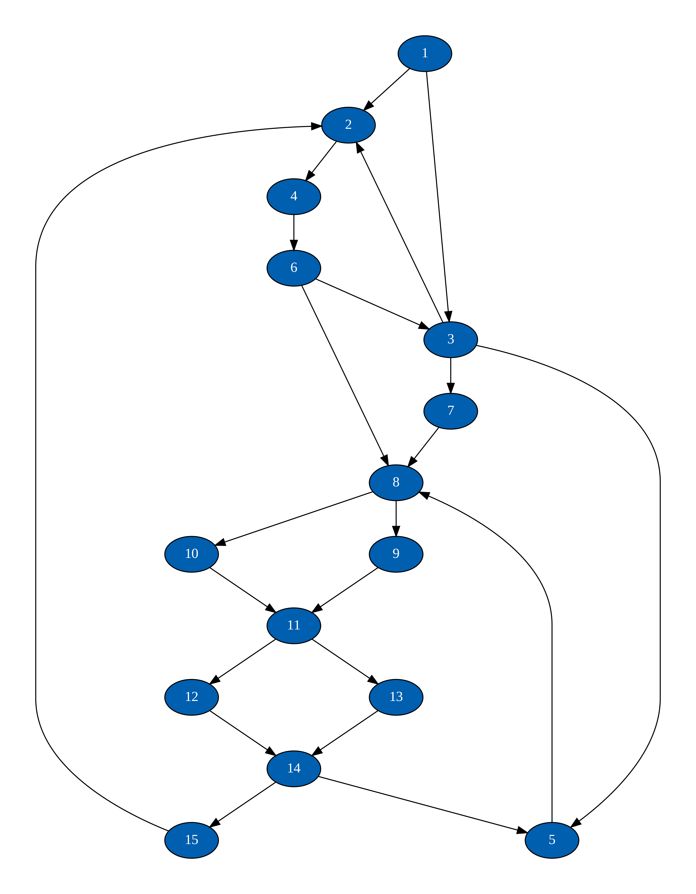

[](https://codecov.io/gh/mdjkenna/GraphStateMachine)
[](https://jitpack.io/#mdjkenna/GraphStateMachine)

# Graph State Machine

### Adding the library to your project

Include the JitPack repository in your project. For example:

```kotlin
repositories {
  mavenCentral()
  maven("https://jitpack.io")
}
```

To add the library to your project, add the dependency to your `build.gradle.kts` file like below:
    
```kotlin
dependencies {
    implementation("com.github.mdjkenna:GraphStateMachine:<latest-release>")
}
```

You can refer to the latest release on JitPack at the top of the README.md file, or in the releases section of the repository.

### What is a graph state machine and why use one ?
State machines can provide a structured way to define possible states of a system, 
including the sequences of states that a system is permitted to transition through. 
They can enforce restrictions to prevent invalid or unintended state changes.

State machines find uses in areas such as:
- Workflow automation
- GUI state management
- Event-driven systems

The core concept of the `GraphStateMachine` is that it models states as vertices within a directed graph. 
Enforcing valid transitions in the state machine can be done by verifying whether a path through the graph exists.
The `GraphStateMachine` represents the landscape of possible states within a state machine as a directed graph, 
where states are represented by vertices.

Using a directed graph as the foundation of a state machine allows for:
- Explicit enforcement of rules about valid state transitions
- Supporting the encapsulation of state machine logic
- An easy to visualise model of possible states and transitions

Depending on usage, the `GraphStateMachine` may resemble a traditional finite state machine (FSM) or can act as an extended FSM by allowing transitions to be dynamically permitted or denied.

### Creating a `GraphStateMachine`

Below is a simplified Kotlin example illustrating how vertices and edges might be added:

```kotlin
fun main() {
    val one = Vertex("1")
    val two = Vertex("2")
    val three = Vertex("3")
    val four = Vertex("4")
    val five = Vertex("5")
    val six = Vertex("6")
    val seven = Vertex("7")
    val eight = Vertex("8")
    
    val stateMachine = buildGraphStateMachine<Vertex, String> {
        buildGraph(one) {

            addVertex(one) {
                addOutgoingEdge {
                    setTo(two)
                }

                addOutgoingEdge {
                    setTo(three)
                }
            }

            addVertex(two) {
                addOutgoingEdge {
                    setTo(four)
                }
            }

            addVertex(three) {
                addOutgoingEdge {
                    setTo(five)
                }

                addOutgoingEdge {
                    setTo(six)
                }
            }

            addVertex(four) {
                addOutgoingEdge {
                    setTo(eight)
                }
            }

            addVertex(five) {
                addOutgoingEdge {
                    setTo(seven)
                }
            }

            addVertex(six) {
                addOutgoingEdge {
                    setTo(seven)
                }
            }

            addVertex(seven) {
                addOutgoingEdge {
                    setTo(eight)
                }
            }

            addVertex(eight)
        }
    }

}
```

The below image illustrates the structure of the graph in the example:

<!--suppress CheckImageSize -->


#### Implementations of IVertex

A vertex that is added to the graph needs to implement the `IVertex<I>` interface.
From the perspective the state machine, the identifier for a vertex (the `ìd` field on `IVertex<I>`) is the only information that is used to identify a vertex.
The identifier has to be unique within the graph. Attempting to add duplicate identifiers when building the graph results in an error.

#### Adding edges

Edges are added by calling `addEdge` on the vertex scope within the builder. 
Vertices can be referenced by edges before they are added to the graph.
All vertices referenced by edges must exist in the graph eventually within the builder function, or an error occurs.

#### Traversal Gates

Traversal gates can dynamically control edge traversal and are either open or closed.
Traversal gates are receiver functions that are set when building an edge, 
returning `true` for open and `false` for closed.

They can dynamically reduce how many ways the graph can be traversed and consequently, 
can dynamically reduce possible state transitions to a subset of those allowed within the graphs structure.

They are optional and don't need to be specified, in which case traversal is never prevented.


```kotlin
buildGraphStateMachineWithTransitionFlags<Vertex, TransitionFlagsImpl> {
    setEdgeTransitionFlags(TransitionFlagsImpl())
    
    buildGraph(one) {
        // ... adding previous vertices
        addVertex(five) {
            addOutgoingEdge {
                setTo(seven)
                setTransitionHandler {
                    // flags available in TransitionScope can be used to block progression through that edge
                    !flags.blockedGoingTo7
                    // can also access the 'from' field here
                }
            }
        }
        // ... adding next vertices
    }
}   
```

**Note:** Specifying transition flags is optional, and can be avoided by using: `buildGraphStateMachine` instead (in which case the no transition flags need to be set by the caller). 
If transition flags are specified via use of the `buildGraphStateMachineWithTransitionFlags`,
an instance of the specified type _must_ be set within the functions scope or an exception will be thrown i.e. *Implementations of `IEdgeTransitionFlags` must be non-null if specified*. 

#### Traversal Types
As mentioned previously, states are transitioned through using DFS.
Traversal types allow the user to control what happens in certain scenarios when traversing the graph.

There are two situations where behavior will vary according to the `EdgeTraversalType` that is configured in the state machine:
- A state transition is blocked by a transition handler initially, but later becomes possible while the edges source vertex is still not fully explored (gray)
- The graph contains cycles

If neither of the above situations are encountered, then there is currently no difference between the traversal types.
The available `EdgeTraversalType` options are:
- **RetrogradeAcyclic:** Rechecks non-visited edges of a gray vertex to explore previously skipped edges
- **ForwardAcyclic:** Resumes traversal from the last visited edge of a vertex, ignoring earlier skipped edges, by tracking a "current edge index" per vertex
- **ForwardCyclic:** Similar to `ForwardAcyclic`, but it does not ignore cycles

##### Note on `ForwardCyclic`:
When transitioning through a cycle the edge index for the new vertex (which is already a partially explored index in the case of a cycle) is reset to the start.
This can cause the state machine to cycle indefinitely through states of a cyclic path. This can be desirable, however caution is needed.
Generally transition flags would be required to stop or prevent this behaviour (if necessary) immediately or after a delay. Vertex state is also an option for coordinating this.

An `EdgeTraversalType` can be specified via the `setTraversalType` function when building the state machine, which is shown in the snippet directly below:

```kotlin
buildGraphStateMachineWithTransitionFlags<TestVertex, TransitionFlagsImpl> {
    setEdgeTransitionFlags(TransitionFlagsImpl())
    setTraversalType(EdgeTraversalType.RetrogradeAcyclic)
    //... building the graph
}   
```

If `EdgeTraversalType` is not set explicitly then `RetrogradeAcyclic` is used.

### Using the `GraphStateMachine`

The `dispatch` function is used to send actions (`GraphStateMachineAction`) to the state machine, which cause state transitions.
**Note:** The `GraphStateMachine` moves through states _one at a time_, with one transition per action.

The main action is `Next` for forward traversal. 
This action might be the only action used depending on the implementation and requirements.
You can see in the below example how the state machine is traversed using the `Next` action using depth first search.

```kotlin
repeat(8) {
    println("Current ID: ${stateMachine.progress.currentStep.id}")
    stateMachine.dispatch(GraphStateMachineAction.Next)
}

/* Output:

Current ID: 1
Current ID: 2
Current ID: 4
Current ID: 8
Current ID: 3
Current ID: 5
Current ID: 7
Current ID: 6

*/
```

The path taken is as a result of DFS and ordered edges in the graph, noting again there is one state transition per action.
Outgoing edges are visited in the order they are added to a vertex by default, 
however the order can be set manually in the edge builder scope to be different to the order of appearance.
The first edge that is valid is the one that is explored at a given point.

There is also a `Previous` action which can be used to go to previous states.
Note that moving to the previous state is unconditional as the `Previous` action simply moves to the state machine to the previous state that it was in.
Depending on requirements and graph structure the `Previous` action could possibly be avoided.

#### Cyclic Graph Example and Traversal Types
Below is a diagram of a 15 vertex graph that contains cycles. It is more complex than the previous 8 vertex graph.
The selection of traversal type becomes more significant for this graph, as does the design of strategies to manage cycle exploration and escape infinite cycles (if applicable).

<!--suppress CheckImageSize -->


If setting a traversal type of: `ForwardCyclic` and starting at vertex 1, 
the state machine will encounter an infinite loop around a cycle starting at vertex 6, the path of which can be seen in the below example. 
There are of course other cycles in the graph, but if starting at vertex 1 and traversing unconditionally, this cycle will not be escaped. 

```kotlin
repeat(10) {
    println("Current ID: ${stateMachine.progress.currentStep.id}")
    stateMachine.dispatch(GraphStateMachineAction.Next)
}

/* Output:

Current ID: 1
Current ID: 2
Current ID: 4
Current ID: 6
Current ID: 3
Current ID: 2
Current ID: 4
Current ID: 6
Current ID: 3
Current ID: 2
 */
```

Moving through cycles in this way can be useful.
Again this loop can be prevented or broken after a delay using transition flags or vertex state to force an alternative edge to be traversed.
Of course, if a loop shouldn't exist at all then it should be avoided in the graph's construction where possible, or a different traversal type used.
 
Let's look at the same graph with a traversal type of `RetrogradeAcyclic`, 
which is the default option (**Note:** Unconditional traversal means `ForwardAcyclic` produces the same path).

```kotlin
repeat(14) {
    println("Current ID: ${stateMachine.progress.currentStep.id}")
    stateMachine.dispatch(GraphStateMachineAction.Next)
}

/* Output:

Current ID: 1
Current ID: 2
Current ID: 4
Current ID: 6
Current ID: 3
Current ID: 7
Current ID: 8
Current ID: 9
Current ID: 11
Current ID: 12
Current ID: 14
Current ID: 5
Current ID: 5
Current ID: 5

 */
```

You can see above that cycles are being skipped when using `RetrogradeAcyclic` and a different path through the graph is taken. 
Note the end state of 5 is reached, with no more available states as a result of ignoring cycles (going to 8 from 5 here would cause a cycle).
The graph discussed in this section can be constructed using the graph state machine builder DSL in the below snippet:

```kotlin
buildGraphStateMachine<Vertex> {
    //... other state machine configuration

    buildGraph(v1) {

        addVertex(v1) {
            addOutgoingEdge {
                setTo(v2)
            }
            addOutgoingEdge {
                setTo(v3)
            }
        }

        addVertex(v2) {
            addOutgoingEdge {
                setTo(v4)
            }
        }

        addVertex(v3) {
            addOutgoingEdge {
                setTo(v2)
            }

            addOutgoingEdge {
                setTo(v7)
            }

            addOutgoingEdge {
                setTo(v5)
            }
        }

        addVertex(v4) {
            addOutgoingEdge {
                setTo(v6)
            }
        }

        addVertex(v5) {
            addOutgoingEdge {
                setTo(v8)
            }
        }

        addVertex(v6) {
            addOutgoingEdge {
                setTo(v3)
            }
            addOutgoingEdge {
                setTo(v8)
            }
        }

        addVertex(v7) {
            addOutgoingEdge {
                setTo(v8)
            }
        }

        addVertex(v8) {
            addOutgoingEdge {
                setTo(v9)
            }
            addOutgoingEdge {
                setTo(v10)
            }
        }

        addVertex(v9) {
            addOutgoingEdge {
                setTo(v11)
            }
        }

        addVertex(v10) {
            addOutgoingEdge {
                setTo(v11)
            }
        }

        addVertex(v11) {
            addOutgoingEdge {
                setTo(v12)
            }
            addOutgoingEdge {
                setTo(v13)
            }
        }

        addVertex(v12) {
            addOutgoingEdge {
                setTo(v14)
            }
        }

        addVertex(v13) {
            addOutgoingEdge {
                setTo(v14)
            }
        }

        addVertex(v14) {
            addOutgoingEdge {
                setTo(v5)
            }
            addOutgoingEdge {
                setTo(v15)
            }
        }

        addVertex(v15) {
            addOutgoingEdge {
                setTo(v2)
            }
        }
    }
}

```

#### Concurrency and mutability

The `GraphStateMachine` is not inherently thread-safe and its usage should be confined to a single thread.
There are many options to achieve this. Currently none are imposed.

As mentioned above, the graph itself can be made completely immutable by using immutable vertices (such as the provided `Vertex` class). 
`IEdgeTransitionFlags` implementations are optionally provided as a way of integrating isolated mutable state into the graph state machine's conditional traversal logic, 
while still keeping the graph itself reusable by other processes.

**Note:** A `Graph` can be built in isolation via the `buildGraphOnly` method, and the resulting `Graph` can be applied in a `GraphStateMachine` builder scope via a setter.
This would allow the graph to be reused freely. 

The library stores no mutable state inside a graph instance, so this is only introduced by the user if they require it within their own vertex implementation.
The library _does_ store mutable state within the traversal components of the `GraphStateMachine`, hence although an immutable graph is reusable by multiple processes and can be accessed by multiple threads, 
the `GraphStateMachine` itself should be confined to a single thread.

_In summary:_ 
- There are multiple ways of handling mutability within the `GraphStateMachine` instance, and the library tries not to be too opinionated about how this is done
- Graph instances are reusable if the `IVertex` implementations are immutable
- Use of a `GraphStateMachine` should always be confined to a single thread. Typically, a flow collector using Kotlin coroutines can achieve this easily, however there are no solutions imposed by the library.
  For example, you could use RxKotlin, or your own custom solution to achieve this


