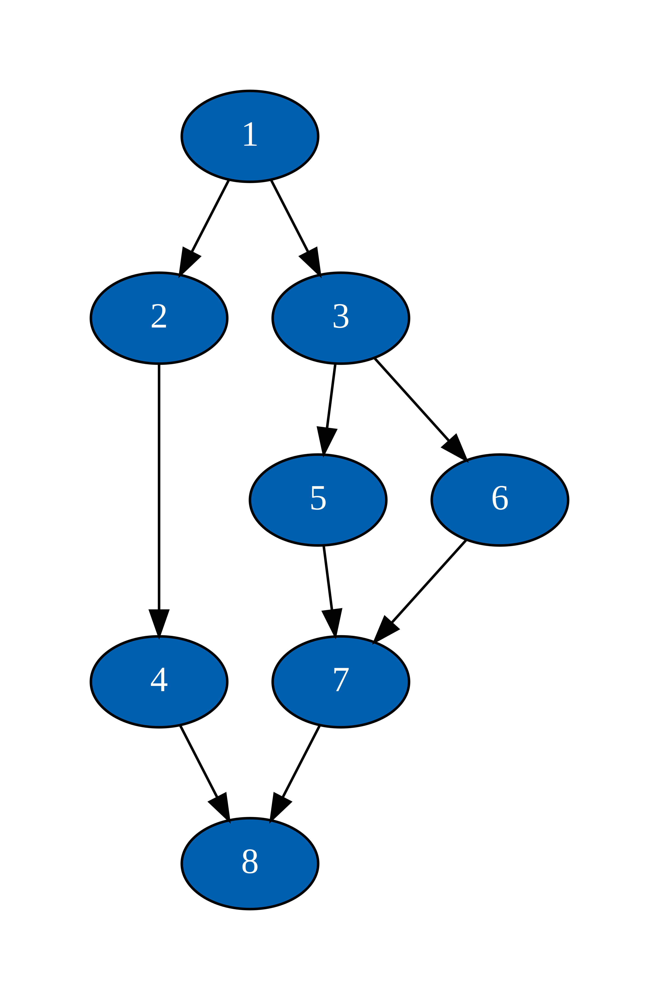

[](https://github.com/mdjkenna/GraphStateMachine/actions/workflows/buildAndTest.yml)
[](https://codecov.io/gh/mdjkenna/GraphStateMachine)
[](https://jitpack.io/#mdjkenna/GraphStateMachine)


# GraphStateMachine

GraphStateMachine is a Kotlin library for modelling state machines using directed graphs.
It provides a declarative way to define possible states in a state machine using a domain-specific language (DSL) based builder.

## Adding the Library to Your Project

Include the JitPack repository in your project. For example:

```kotlin 
repositories {
    mavenCentral()
    maven("https://jitpack.io")
}
```

Then add GraphStateMachine as a dependency:

```kotlin
dependencies {
    implementation("com.github.mdjkenna:GraphStateMachine:<latest-release>")
}
```

Find the latest release version at the top of this README or in the Releases section of the GitHub repository.
All versions with a major version of `0` are experimental and may include breaking API changes.

## Getting Started

<details>
<summary>What is this?</summary>

`GraphStateMachine` represents the possible states within a state machine as a directed graph,
where vertices are states and edges are transitions between states.

Advantages include:

- **Declarative State Modelling**: Define state machine behaviour using a directed graph,
  declaratively specifying possible states and transitions.
  The absence of an edge in the graph implicitly prevents invalid transitions.
  This declarative approach makes correct state management more robust and easier to achieve than procedural implementations.

- **Visualisation and Communication**: The graph-based model is inherently visual,
  simplifying understanding and communicating the behaviour of stateful systems such as application UI state or custom protocols.

- **Flexibility**: Define complex state machine behaviour with less time and effort. Previously prohibitively complex behaviour is now manageable.
  The library supports state guards and cyclic paths, placing no limits on the simplicity or complexity of your state machines.

- **Focus**: GraphStateMachine does one thing.
  It defines and runs state machines using a graph model.
  It has no third-party dependencies, avoiding the addition of transitive dependencies to your project.

</details>

<details>
<summary>Defining a State Machine</summary>

Here's a simple example of an 8 vertex directed acyclic graph:

<!--suppress CheckImageSize -->


GraphStateMachine provides a DSL for defining the vertices and edges of the state machine graph.

Inside the `GraphBuilderScope`, add vertices to the graph using `addVertex`.
Within the vertex builder scope, use `addEdge` to add outgoing edges to a vertex.

The key steps are:

1. Define your states as instances of a class that implements `IVertex<I>`
2. Use `buildGraphStateMachine` to create a new machine
3. Within this scope, use `buildGraph` to define the graph structure
4. Add each state as a vertex with `addVertex`
5. For each vertex, add its allowed transitions as outgoing edges with `addEdge` in the order they should be traversed

This structure allows you to declaratively specify all possible states and transitions of your state machine.
The 8 vertex DAG above is used in a state machine in the following example:

```kotlin
fun main() {
    val one = Vertex("1")
    val two = Vertex("2")
    val three = Vertex("3")
    val four = Vertex("4")
    val five = Vertex("5")
    val six = Vertex("6")
    val seven = Vertex("7")
    val eight = Vertex("8")
    
    val stateMachine = buildGraphStateMachine<Vertex, String> {
        buildGraph(one) {

            addVertex(one) {
                addEdge {
                    setTo(two)
                }

                addEdge { // Edge traversal order defaults to order of appearance. It can also be set as a parameter.
                    setTo(three)
                }
            }

            addVertex(two) {
                addEdge {
                    setTo(four)
                }
            }

            addVertex(three) {
                addEdge {
                    setTo(five)
                }

                addEdge {
                    setTo(six)
                }
            }

            addVertex(four) {
                addEdge {
                    setTo(eight)
                }
            }

            addVertex(five) {
                addEdge {
                    setTo(seven)
                }
            }

            addVertex(six) {
                addEdge {
                    setTo(seven)
                }
            }

            addVertex(seven) {
                addEdge {
                    setTo(eight)
                }
            }
            
            addVertex(eight)
        }
    }

}
```

#### Implementations of IVertex

A vertex added to the graph must implement the `IVertex<I>` interface.
The vertex id must be unique within the graph. Adding duplicate ids when building the graph results in an error.

Any valid `IVertex<I>` implementation can be used as a graph vertex.
The `id` field is of type `I`.
The library provides predefined simple vertex implementations for convenience.
You can also use custom vertex implementations with user-defined types for `I`.

#### Adding outgoing edges

Add edges to the graph as directed outgoing edges _from_ a vertex.
Once the graph is built, edges have a fixed traversal order to ensure predictable and consistent edge visitation.
If needed, specify an order parameter, ensuring it is unique per edge to avoid non-deterministic sorting.

The vertex an edge is coming from will already be added to the graph.
The `to` property of an edge is the identifier of the vertex the edge points to.

All vertices referenced by a `to` property should be added before building the graph or an error is thrown.
However, an edge can temporarily reference a vertex that hasn't been added to the graph while the graph is being built.
This allows adding edges to the graph in any order, as long as the vertex referenced by the `to` property exists within the graph by the end of the builder function.

</details>

<details>
<summary>Using the State Machine</summary>

Once you've defined your `GraphStateMachine`, dispatch actions to trigger state changes.

```kotlin
repeat(8) {
    println("Current ID: ${stateMachine.progress.currentStep.id}")
    stateMachine.dispatch(GraphStateMachineAction.Next)
}

/* Output - based on 8 vertex DAG defined above, starting at vertex 1, traversing one at a time using DFS:

Current ID: 1
Current ID: 2
Current ID: 4
Current ID: 8
Current ID: 3
Current ID: 5
Current ID: 7
Current ID: 6

*/
```

Dispatching a `Next` action causes the state machine to transition to the next state according to the graph structure and traversal type, using depth-first search.

The `Previous` action unconditionally transitions the state machine to the previous state.
</details>

<details>
<summary>Traversal Guards</summary>

In a `GraphStateMachine`, state transitions occur by traversing edges.
Traversal guards are functions that can block state transitions by blocking traversal.
They dynamically constrain possible state transitions to a subset of those defined by the graph, based on external conditions.

```kotlin
addEdge {
    setTo(exampleVertex)
    setTraversalGuard {
        // traversal guard scope
        !guardState.isExampleTransitionBlocked 
    }
}
```

Returning `false` in the traversal guard function blocks the state transition.
Traversal guard functions have a `TraversalGuardScope` receiver, which provides data to the implementer,
such as `guardState` shown above, which can hold arbitrary caller state.

</details>

<details>
<summary>Traversal Guard State</summary>

The guard state object is an implementation of `ITraversalGuardState`.
There is a single instance per graph state machine, which can be passed as a parameter into one of the builder functions.
It can also be omitted, in which case no `ITraversalGuardState` type parameter is needed.

```kotlin
class GuardState(
    var isSomeTransitionBlocked: Boolean = false
) : ITraversalGuardState

val stateMachine = buildGraphStateMachine<StringVertex, String, GuardState>(GuardState()) {
    // ...
}
```

The `ITraversalGuardState` instance is made available to `TraversalGuard` functions via their `TraversalGuardScope` receiver.
</details>

<details>
<summary>Using Cycles</summary>

Cycles can be added to a state machine graph.
By default, they are ignored.
To traverse cycles, set the traversal type to: `EdgeTraversalType.DFSCyclic`

Here's how cycles are handled:

- **Edge Index Reset**: When the state machine arrives at a vertex,
  it resets that vertex's edge index to zero.
  Even if the state machine previously left that vertex via edge 0,
  it will attempt to traverse edge 0 again upon revisiting the vertex.

- **Infinite Loops**: By design, cycles in GraphStateMachine are potentially infinite loops.
  The library does not automatically break cycles, as this could lead to erroneously excluding states.
  Instead, the user must coordinate cycle behaviour using transition guards as needed.

Here's a simple example of using a traversal guard to limit the number of times a cycle is taken:

```kotlin
class GuardState(
    var cycleCount: Int = 0
) : ITraversalGuardState {
    override fun onReset() {
        cycleCount = 0
    }
}

buildGraphStateMachine<StringVertex, String, GuardState>(GuardState()) {
    setTraversalType(EdgeTraversalType.DFSCyclic)
    buildGraph(stateOne) {
        addVertex(stateOne) {
            addEdge {
                setTo(stateOne) // A cycle to itself
                setTransitionHandler {
                    if (guardState.cycleCount < 3) {
                        guardState.cycleCount++
                        true
                    } else {
                        false
                    }
                }
            }
        }
    }
}
```

In this example, the state machine will cycle on `stateOne` up to 3 times before the guard blocks further cycles.
</details>

<details>
<summary>Some Considerations</summary>

**Edge Traversal Order**: 

Edges have a fixed traversal order to ensure predictable and consistent state transitions. 
By default, edges are traversed in the order they are added to a vertex. 
You can optionally explicitly set the traversal order using the order parameter in addEdge. 
Edges are sorted by their order value ascending, so lower order values are visited first.

**Edge Traversal Progression**: 

Edges have a traversal order for deterministic traversal. The state machine keeps track of the next outgoing edge to traverse. 
The current edge (or edge index) increases until all edges are explored.

**Resetting Edge Traversal Progression**:

A vertex becoming the current state clears all edge progression.
Arriving at a vertex always results in identical subsequent traversal behaviour within the state machine.
Every time a vertex becomes state, the edge visitation order that follows is the same every time, and is identical to the first time that vertex became current state.

There are two scenarios where a vertex that has already been current state can become current state again:
1. When the state machine revisits a vertex as part of forward traversal (a cycle)
2. When arriving at a vertex from a `Previous` action

Resetting edge progression in this way is important for flexibility and predictability. 
It avoids baking additional edge exclusion into the library traversal mechanisms and allows for useful behaviour.
It is also more analogous to how state transition rules are defined in traditional state machines.
Library users can exclude edges using traversal guards if required.

This is the reason why, as the section describing cycles above touched on, cycles are infinite loops by standard,
requiring coordination with traversal guards to break out of this. Looping for cycles can be desirable, however ultimately the behaviour can be changed by the caller.

Additional configuration options surrounding this topic will be made available in the future.

**Concurrency:**

Actions are dispatched to the state machine synchronously.
There are no thread synchronisation or general concurrency handling mechanisms build into the state machine.
If they are needed the API facilitates using them without imposing any in particular.

There is only one rule with concurrency: All actions should be dispatched within the same thread.

The most idiomatic way of using a `GraphStateMachine` in concurrent environments would be something that emulates an actor or single threaded 'mailbox', such as a `Flow` of graph state machine actions with a single threaded flow collector,
but a variety of approaches are possible. There will be support added for coroutines in the future.

The state machine also has a callback that can be set for state updates, to publish state updates in a thread safe manner, 
such as to some variety of volatile state holder, if needed.

</details>