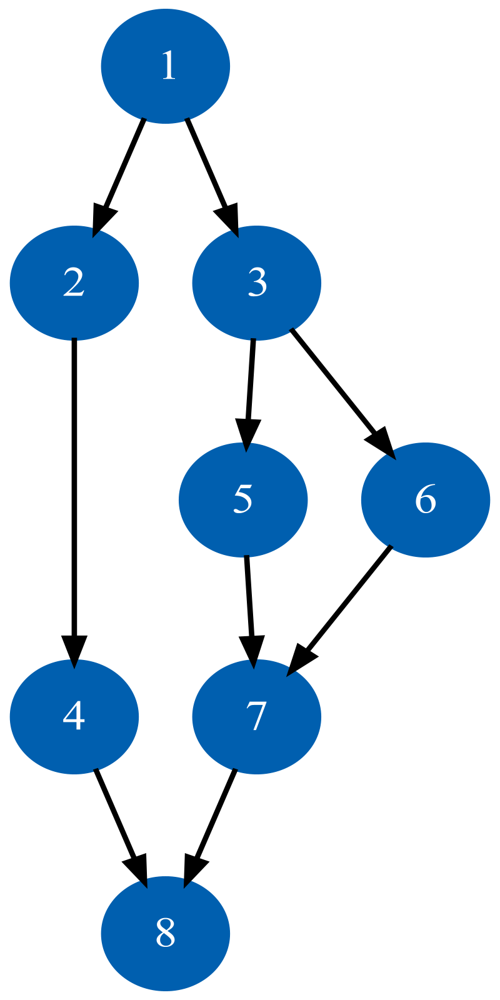

[](https://github.com/mdjkenna/GraphStateMachine/actions/workflows/buildAndTest.yml)
[](https://codecov.io/gh/mdjkenna/GraphStateMachine)
[](https://central.sonatype.com/artifact/io.github.mdjkenna/graph-state-machine)


[](https://github.com/mdjkenna/GraphStateMachine)

# GraphStateMachine

This is a Kotlin library for creating state machines designed by building a directed graph of states and their transitions.
State machine behaviour is defined by specifying possible states and transitions in a Kotlin domain-specific-language (DSL) style builder.

Advantages of this approach include:

- **Validation**: Invalid transitions are implicitly prevented by the absence of an edge in the graph.

- **Declarative State Modeling**: The Kotlin DSL avoids complex procedural code that can be difficult to maintain.

- **Visualization and Communication**: Generate DOT language representations of your state machines to visualize and verify possible state transitions.

- **Flexibility**: The library's features offer flexible ways to structure state machines and customize their behavior.

- **Focus**: A focused implementation with no third-party dependencies (except for coroutines), which avoids adding transitive dependencies to your project.

Features and highlights:
- Configurable movement through the graph model
- Supports moving to previous states
- Cycles and conditional transitions through the graph are fully supported
- Effects are supported within the state model itself
- Action arguments can be dispatched to a state machine allowing for conditional transition decisions
- Predictable and atomic state transitions via a single-threaded actor model

There are two types of state machine in the library: `Traverser` and `Walker` - each can move through the graph differently, with its own set of advantages.
The API is explained in detail in the following sections.

## Adding the Library to Your Project

Add Maven Central and then add the package as a dependency. Replace `<version>` with the required version.
The latest version is visible above in the Maven badge.

```kotlin
repositories {
    mavenCentral()
}

dependencies {
    implementation("io.github.mdjkenna:graph-state-machine:<version>")
}
```

## Getting Started

<details>
<summary>Defining a State Machine</summary>

The following 8 vertex directed acyclic graph can be represented easily in the graph builder DSL:

<!--suppress CheckImageSize -->


_The above graph image was made using a dot language representation of the 8 vertex DAG in the example below and inputting this into GraphViz. 
Further customisation is available for these diagrams - discussed more in the last section._ 

GraphStateMachine provides a DSL for defining vertices (states) and edges (transitions) of your state machine graph. 
Vertices must implement the `IVertex<I>` interface, and edges define the allowed transitions between states.
Edges are traversed in the order they're added unless specified otherwise with an `order` parameter.

The following example creates a `Traverser` using the 8 vertex DAG in the image above using the graph builder DSL:

```kotlin
// Vertex must implement IVertex. A data class is a good choice.
data class Vertex(override val id: String) : IVertex<String>

fun main() {
    val one = Vertex("1")
    val two = Vertex("2")
    val three = Vertex("3")
    val four = Vertex("4")
    val five = Vertex("5")
    val six = Vertex("6")
    val seven = Vertex("7")
    val eight = Vertex("8")

    val traverser = buildTraverser<Vertex, String, ITransitionGuardState, Nothing> {
        buildGraph(one) {

            addVertex(one) {
                addEdge {
                    setTo(two)
                }

                addEdge {
                    setTo(three)
                }
            }

            addVertex(two) {
                addEdge {
                    setTo(four)
                }
            }

            addVertex(three) {
                addEdge {
                    setTo(five)
                }

                addEdge {
                    setTo(six)
                }
            }

            addVertex(four) {
                addEdge {
                    setTo(eight)
                }
            }

            addVertex(five) {
                addEdge {
                    setTo(seven)
                }
            }

            addVertex(six) {
                addEdge {
                    setTo(seven)
                }
            }

            addVertex(seven) {
                addEdge {
                    setTo(eight)
                }
            }

            addVertex(eight)
        }
    }
}
```

In this example, edges are traversed using DFS, with neighbouring edges explored in the order they are added to a vertex. 
For vertex "one", the edge to "two" will be tried first, followed by the edge to "three". 
You can also explicitly set the traversal order using the `order` parameter in `addEdge`.
Note that several `buildTraverser` overloads exist for different use cases (with/without guard state, with/without action arguments); the simplest form is shown here.

#### Implementations of IVertex

Vertices added to the graph must implement the `IVertex<I>` interface.
The vertex id must be unique within the graph. Adding duplicate ids when building the graph results in an error.

Any valid `IVertex<I>` implementation can be used as a graph vertex.
The `id` field is of type `I`.
The library provides predefined simple vertex implementations for convenience.
You can also use custom vertex implementations with user-defined types for `I`.

#### Adding outgoing edges

Add edges to the graph as directed outgoing edges _from_ a vertex.
Once the graph is built, edges have a fixed traversal order to ensure predictable and consistent edge visitation.

You can define an edge to a vertex before that vertex has been formally added to the graph builder. This allows for flexibility in ordering your definitions. However, all vertices must be added to the graph by the time the builder function completes to avoid an error.

</details>

<details>
<summary>Walkers and Traversers: Use Cases</summary>

The library provides two types of graph state machine: `Traverser` and `Walker`. 
The most efficient and practical choice between a `Traverser` or `Walker` depends on the use case.

##### Traversers
Traversers implement standard depth-first search (DFS) which naturally includes backtracking,
meaning they backtrack through ancestor vertices to find unvisited paths.
When a traverser reaches a vertex with no valid outgoing edges, it will backtrack to find alternative paths.
They also support moving to previous states.

You can access the history of visited states on Traversers using the `tracePath()` method:

```kotlin
val path = traverser.tracePath()
```

This returns a list of vertices representing the traversal path, ordered from start to current.

###### Considerations if using a traverser

Traversers maintain a history (breadcrumbs) to support their backtracking and bidirectional abilities.
As a result, their memory usage is not constant and increases with the traversal depth.
This is only significant in specific scenarios.   
Note that moving to previous vertices does the opposite - removing breadcrumbs from the current traversal path.
If traversing forward constantly in a long-running loop for example the increased 
memory usage could become a consideration. 

###### Use cases for Traversers

Traversers are naturally suited to scenarios where DFS traversal through a state model is desired i.e. backtracking.
For example: An application wizard or workflow, navigation through screens, or a finite custom protocol for handling data validation.
The `tracePath()` method mentioned above is particularly useful for processing wizard or workflow results.

##### Walkers
Walkers transition through the first available, unblocked edge.
When a walker reaches a vertex with no valid outgoing edges it simply stops as it doesn't retain breadcrumbs to support backtracking.
Walkers are ideal for more long-running or intense processes as their memory usage remains constant regardless of how far they walk.

###### Use cases for Walkers

Walkers can be a more straightforward choice if backtracking or moving to previous states is not required.
Additionally, they might be a preference if you would prefer designing graphs for walkers due to the extremely straightforward nature of their movement.  
They are suited to scenarios where many or effectively infinite transitions can occur, such as looping around a cycle indefinitely.
For example: Indefinitely running automatic tasks on the cloud / server, forward navigation through screens using cycles for back movement, ongoing tasks

| Feature       | Traversers                                       | Walkers                               |
|---------------|--------------------------------------------------|---------------------------------------|
| Direction     | Bidirectional (Next/Previous)                    | Forward-only (Next)                   |
| History       | Maintains full path history for DFS backtracking | No history                            |
| Memory Usage  | Increases with path length over time             | Constant                              |
| Cycle Support | Optional (must be enabled)                       | Always supported                      |
| Use Cases     | Wizards, finite workflows, undo operations       | Long-running or high throughput tasks |

The memory usage difference between `Walkers` and `Traversers` is negligible in most scenarios. It only becomes a consideration for very long-running processes or those with extremely high throughput.

#### Traversers: Resetting Edge Traversal Progression

**Note this is only applicable to traversers:**

Each time a traverser arrives at a vertex, it re-evaluates outgoing edges from the beginning of their defined order. 
It does not resume from where it left off on a previous visit. 

There are two scenarios where a vertex that has already been the current state can become the current state again:
1. When the state machine revisits a vertex as part of forward traversal (a cycle)
2. When arriving at a vertex from a `Previous` action (in traversers only)

This means that cycles in the graph are potentially infinite loops by default (which is described in more detail in a section below),
requiring transition guards to break out of cycles when needed.

</details>

<details>
<summary>Observing State Changes</summary>

For both walkers and traversers, the current state is published through a `StateFlow`.
This can then be used as part of the Kotlin coroutines API, such as being collected.

```kotlin
val traverser = buildTraverser<Vertex, String> {
    // graph implementation
}

scope.launch {
  traverser.current.collect { traversalState ->
        // consume state ...
    }
}
```

</details>

<details>
<summary>Actions and Navigation</summary>

#### Basic Actions
You induce state transitions in both traversers and walkers by dispatching actions to them.
Traversers accept actions to move `Next`, `Previous`, or `Reset`.
Walkers accept `Next` and `Reset` actions, but not `Previous` actions, as they do not retain a history of visited states.

```kotlin
// Asynchronous dispatch without waiting (fire and forget)
traverser.launchDispatch(GraphStateMachineAction.Next)
traverser.launchDispatch(GraphStateMachineAction.Previous)
traverser.launchDispatch(GraphStateMachineAction.Reset)

// Suspend until the action is received (but don't wait for completion)
scope.launch {
    traverser.dispatch(GraphStateMachineAction.Next)
    traverser.dispatch(GraphStateMachineAction.Previous)
    traverser.dispatch(GraphStateMachineAction.Reset)
}

// Dispatch and await the new state
scope.launch {
    val result = traverser.dispatchAndAwaitResult(GraphStateMachineAction.Next)
    // Now you can use the new state
}
```

#### Actions with Arguments

`Next` actions can also have arguments. 
Arguments passed with a `Next` action are included in the resulting state publication, making them available for state processing. 
They can also be used for conditional edge transitions or `onBeforeVisit` handlers (explained in the respective sections below).

```kotlin
data class NavigationArgs(val targetId: String, val options: Map<String, Any> = emptyMap())

// Using launchDispatch (fire and forget)
traverser.launchDispatch(GraphStateMachineAction.NextArgs(NavigationArgs("destination-screen")))

// Or using dispatchAndAwaitResult to get the result
scope.launch {
    val result = traverser.dispatchAndAwaitResult(
        GraphStateMachineAction.NextArgs(NavigationArgs("destination-screen"))
    )
    // Now you can use the result
}
```
</details>

<details>
<summary>Transition Guards and Guard State</summary>

Transition guards can block transitions across edges based on your own conditions. 
They dynamically constrain state transitions to a subset of those defined in the graph.

```kotlin
addEdge {
    setTo(exampleVertex)
    setEdgeTransitionGuard {
        !guardState.isExampleTransitionBlocked 
    }
}
```

Returning `false` in the transition guard function blocks the state transition.
Transition guard functions have a `TransitionGuardScope` receiver, which provides data to the implementer,
such as `guardState` shown above. 

Transition guards can also access arguments passed with actions:

```kotlin
setEdgeTransitionGuard {
    args != null && args.targetId == "details-screen"
}
```

This guard only allows traversal if the action arguments specify a particular target ID.
As suspend functions, transition guards can also perform asynchronous operations:

```kotlin
setEdgeTransitionGuard {
    val isAllowed = checkPermissions()
    isAllowed
}
```

#### Guard State

The guard state is a user-defined implementation of the `ITransitionGuardState` interface.
There is a single instance per graph, which can be passed as a parameter into one of the builder functions.
It can also be omitted, in which case no `ITransitionGuardState` type parameter is needed.

```kotlin
class GuardState(
    var isSomeTransitionBlocked: Boolean = false
) : ITransitionGuardState

val traverser = buildTraverser<StringVertex, String, GuardState>(GuardState()) {
    buildGraph(startVertex) {
        addVertex(startVertex) {
            addEdge {
                setTo(nextVertex)
                setEdgeTransitionGuard {
                    !guardState.isSomeTransitionBlocked
                }
            }
        }
    }
}
```

The guard state is passed to the builder function and made available to all transition guards.
The `ITransitionGuardState` instance is made available to `TransitionGuardScope` functions via their `TransitionGuardScope` receiver.

This shared state can be used to:
- Store information that affects multiple transitions
- Implement complex transition logic that depends on the history of transitions
- Share data between different parts of the state machine

</details>

<details>
<summary>Handling Before Incoming and Outgoing transitions</summary>

GraphStateMachine provides `BeforeVisitHandler` and `OutgoingTransitionHandler` to execute custom logic at specific points during state transitions.

#### BeforeVisitHandler - Before Arriving

`BeforeVisitHandler` executes logic immediately before a vertex is visited and published as the current state. 
It is useful for setup operations or validating preconditions before the new state is officially reached.

```kotlin
addVertex(loadingState) {
    onBeforeVisit {
        // Access the vertex about to be visited
        println("About to visit: ${vertex.id}")

        // Access any arguments passed with the action
        args?.let { arguments ->
            println("Action arguments: $arguments")
        }

        // Progress through current state without publishing it - See Intermediate states
        autoAdvance()
    }

    addEdge {
        setTo(nextState)
    }
}
```

The `BeforeVisitHandler` receives a `BeforeVisitScope` which provides access to:
- The vertex that is about to be visited
- The shared guard state for the entire state machine
- Any arguments passed with the current action

The `BeforeVisitHandler` can call `autoAdvance()`, which signals the state machine to automatically advance to the next state without publishing the current vertex as the state, allowing for automatic progression through certain vertices.

#### OutgoingTransitionHandler - Before Leaving

`OutgoingTransitionHandler` executes logic before any outgoing transitions from the current vertex are explored. 
It allows you to prevent transitions altogether, making it ideal for conditional navigation.

```kotlin
addVertex(conditionalState) {
    onOutgoingTransition {
        // Access the current vertex
        println("Considering transitions from: ${vertex.id}")

        // Access arguments and guard state
        if (args?.shouldStayInCurrentState == true) {
            // Prevent any transitions from occurring
            noTransition()
        }

        // Perform any logic before transitions are considered
        updateTransitionMetrics()
    }

    addEdge {
        setTo(nextState)
    }
}
```

The `OutgoingTransitionHandler` receives an `OutgoingTransitionScope` which provides access to:
- The current vertex from which transitions are being considered
- The shared guard state for the entire state machine  
- Any arguments passed with the current action

The `OutgoingTransitionHandler` can call `noTransition()`, which prevents the state machine from exploring any outgoing edges and keeps the current vertex as the state. 
This is particularly useful for implementing conditional logic that determines whether state transitions should occur based on runtime conditions.

Both handlers are suspend functions, allowing them to perform asynchronous operations as needed. 
They integrate seamlessly with the state machine's single-threaded actor model, ensuring predictable and atomic execution.

</details>

<details>
<summary>Intermediate States</summary>

Intermediate states are "in-between" states that are not published or observed. 
They are automatically advanced through without being published as the current state.
Their main purpose is to represent side effects however they are not limited to this.

State machine libraries often contain constructs called "effects" to represent side effects which do not change the main state. 
Intermediate states are equivalent to "effects", however they are treated as a special type of state within the graph model itself.

This approach integrates effects and operations directly into the state machine's architecture in a more traditional sense, where all "operations" and "processes" including effects converge onto the state machines main state.
They are positioned within the landscape of possible states, giving them a specific context in which they can run.

- **Effects as State**: Represent effect operations as explicit states that can only occur within specific contexts
- **Control Flow Clarity**: Make the flow of your application visible in the graph structure itself
- **Perform Operations with Guarantees**: Clearly guarantee particular tasks will only be executed in certain scenarios and easily visualise what those scenarios are

The core benefit of this approach is that the *entire* behavior of your system is explicitly defined and visualized in the graph. There are no 'hidden' operations occurring between states. This leads to:
-   **Enhanced Testability**: You can test the control flow logic of your state machine without executing the actual side effects. For instance, you can verify that a specific action correctly leads to the `PerformNetworkRequest` intermediate state without making a real network call.
-   **Improved Visibility**: When side effects are vertices in the graph, the complete flow of your application is self-documenting. This makes it easier for new developers to understand the system and for anyone to debug issues, as the graph visualization tells the whole story.
-   **Simplified Maintainability**: As your application's logic evolves, modifying the flow becomes a matter of rewiring the graph. Adding, removing, or reordering operations is more straightforward than refactoring complex imperative code blocks that might handle side effects outside of the state machine.

#### How Intermediate States Work

When a vertex is marked as an intermediate state:

1. Just before a vertex `V1` is visited, its `onBeforeVisit` handler is executed, and the `autoAdvance` function is invoked within the `BeforeVisitScope`
2. If using a traverser - the vertex is recorded in the traced path but never published as the current state
3. The state machine immediately advances to the next state and `V1` was never published, making it an intermediate state

Note when processing previous actions the intermediate states are skipped over.

#### Creating Intermediate States

To mark a vertex as an intermediate state, call `autoAdvance()` within its `onBeforeVisit` handler:

```kotlin
addVertex(loadingState) {
    onBeforeVisit {
        showLoading()
        withContext(Dispatchers.IO) {
            diskOperation()
        }
        hideLoading()

        autoAdvance()
    }

    addEdge {
        setTo(dataLoadedState)
    }
}
```

`onBeforeVisit` is called just before a vertex will be arrived at after a successful transition, but before that vertex is published as the current state.
In this example, the loading state is marked as intermediate by calling `autoAdvance()` - advancing to the next state before publishing `loadingState`. 
As a result `loadingState` is never perceived by observers, it will immediately advance to the data loaded state once the operation completes.

Intermediate states solve common problems in a more traditional state machine oriented fashion:

- **Effect Usage For Screen State**: As in the above example, perform generic side effects or other UI updates
- **Multistep Operations and Custom Protocols**: Create chains of operations that execute in sequence without exposing intermediate steps, potentially having complex conditional paths.

</details>

<details>
<summary>Using Cycles</summary>

The graph can contain any number of cycles and these are supported.
When using a `Walker` cycles are always followed.
When using a `Traverser` cycles are ignored by default but can be traversed by setting the traversal type to: `EdgeTraversalType.DFSCyclic` in the traverser builder. 

There are two points to consider when designing a `Traverser` on a graph with cycles:

- **Edge Index Reset**: When the traverser arrives at a vertex, it resets that vertex's edge index to zero.
  Even if the `Traverser` previously left that vertex via edge 0, or edge 1 - ∞, it will attempt to traverse edge 0 again upon revisiting the vertex.

- **Infinite Loops**: As a result of the above point - cycles can create infinite loops. 
  To avoid infinite loops through cycles, the user must coordinate cycle behavior using transition guards to break cycles as needed. 
  This offers full control without the library getting in the way of required behaviour, allowing state machines to loop through cycles as often as needed.

Here's a simple example of using a transition guard to limit the number of times a cycle is taken:

```kotlin
class GuardState(
    var cycleCount: Int = 0
) : ITransitionGuardState {
    override fun onReset() {
        cycleCount = 0
    }
}

buildTraverser<StringVertex, String, GuardState>(GuardState()) {
    setTraversalType(EdgeTraversalType.DFSCyclic)
    buildGraph(stateOne) {
        addVertex(stateOne) {
            addEdge {
                setTo(stateOne)
                setEdgeTransitionGuard {
                    if (guardState.cycleCount < 3) {
                        guardState.cycleCount++
                        true
                    } else {
                        false
                    }
                }
            }
        }
    }
}
```

In this example, the vertex has an edge pointing back to itself, creating a cycle. 
The transition guard allows the cycle to be taken up to 3 times before blocking further traversal, demonstrating how to control infinite loops in cyclic graphs.

</details>

<details>
<summary>Concurrency</summary>

Both `Traversers` and `Walkers` use an actor model, processing actions sequentially on a single-threaded event loop.

#### Single-Threaded Execution

The graph state machine operates on a coroutine scope with a single-threaded dispatcher.
All user-defined handlers (transition guards, onBeforeVisit handlers) are suspend functions which are invoked on this same thread, providing several benefits.
You can freely read and write to data confined within the state machine without worrying about visibility or synchronization issues.

A coroutine scope is generated as a default parameter when building a `Traverser` or `Walker`, but a user provided one can be included.
It is the implementer's responsibility to ensure a coroutine scope they provide is single-threaded.

GraphStateMachine processes one action at a time in a sequential manner. When actions are dispatched to the state machine:
The state machine processes actions atomically, completing each one before starting the next.

For example, if multiple components dispatch actions simultaneously:

```kotlin
// These actions will be processed one after another and will not 'interleave' between yields or suspension points
traverser.dispatch(GraphStateMachineAction.Next)
traverser.dispatch(GraphStateMachineAction.NextArgs(someArgs))
traverser.dispatch(GraphStateMachineAction.Previous)
```

This gives us consistent state transitions, avoids race conditions, and encourages simplicity and performance.

#### StateFlow for State Updates

The current state is published through a `StateFlow`

```kotlin
scope.launch {
  traverser.current.collect { traversalState ->
        updateUI(traversalState.vertex)
    }
}
```

#### GraphStateMachineScopeFactory

The `GraphStateMachineScopeFactory` provides a factory method to create a new `CoroutineScope` with the appropriate single-threaded dispatcher:

```kotlin
val scope = GraphStateMachineScopeFactory.newScope()
```

Each `Traverser` or `Walker` instance must have its own separate scope, 
but the underlying dispatcher can be shared across multiple instances, allowing them to operate on the same thread if needed, such as an application main thread. 

The factory provides a convenient default configuration with a single-threaded dispatcher. 
Note all the default scopes created using this factory share the same underlying single-threaded dispatcher.

</details>

<details>
<summary>Destructuring</summary>

Both traversers and walkers support Kotlin's destructuring syntax, 
allowing you to separate the state reading and action dispatching capabilities.

```kotlin
// Destructuring a traverser
val (traverserState, traverserDispatcher) = traverser

// Destructuring a walker
val (walkerState, walkerDispatcher) = walker
```

The above enables controlled access and can be conducive to separation of concerns:
- `TraverserState`/`WalkerState` provides read-only access to the current state via `current` StateFlow
- `TraverserDispatcher`/`WalkerDispatcher` provides methods to dispatch actions that modify state

</details>

<details>
<summary>Visualise your state machine</summary>

The `DotGenerator` class can generate DOT language representations of your state machines. DOT is a text-based graph description language that can be visualized with various tools.

The 8-vertex DAG shown at the top of this README was created using this feature.

#### Basic Usage

```kotlin
// Assumes 'graph' is a built graph from the builder
// and 'Vertex' is the class from the 'Getting Started' section.
val dotGenerator = DotGenerator<Vertex, String, ITransitionGuardState, Any>()
val dotContent = dotGenerator.generateDot(graph, "MyStateMachine")
```

#### Customization

You can customize the appearance of your graph with configuration options and decorations:

```kotlin
val dotGenerator = DotGenerator<Vertex, String, ITransitionGuardState, Any>(
    DotConfig(
        rankDir = "LR",  // Left to right layout
        showEdgeIndices = true
    )
)
    .decorateVertex("start", VertexDecoration(
        description = "Start State",
        fillColor = "green"
    ))
    .decorateEdge("start", "processing", EdgeDecoration(
        description = "Begin Processing",
        color = "blue"
    ))
```

The `DotConfig` class provides options to control graph layout, while decoration classes allow styling of vertices, edges, and transition guards. 
For advanced customization, refer to DOT language documentation.

#### Visualization

Once generated, you can visualize your state machine using:
- Graphviz (used for the example at the top of this README)
- Online DOT viewers
- IDE plugins
- Python or Kotlin notebooks with appropriate libraries
- Terminal tools

This visualization helps in understanding, documenting, communicating and debugging your state machines by providing a clear representation of your application's state flow.

</details>
